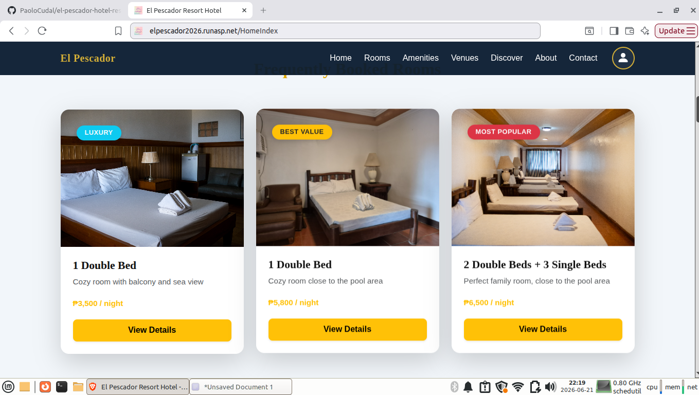
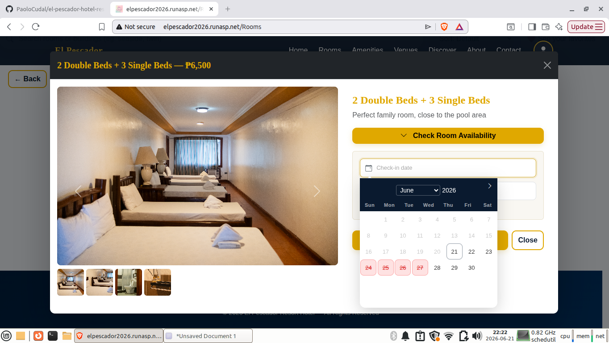
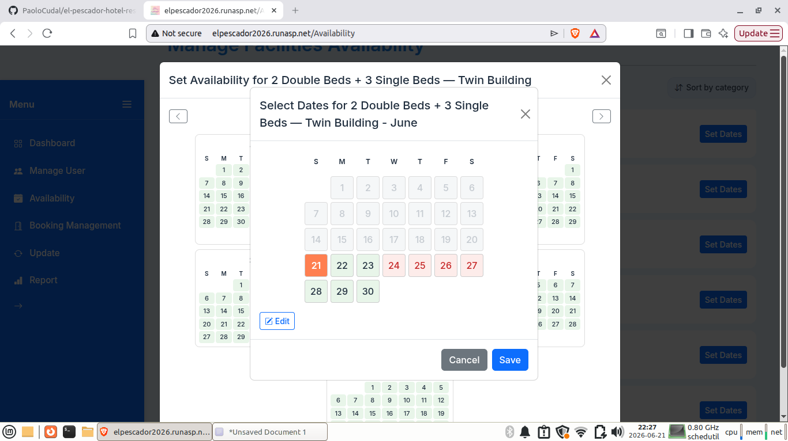
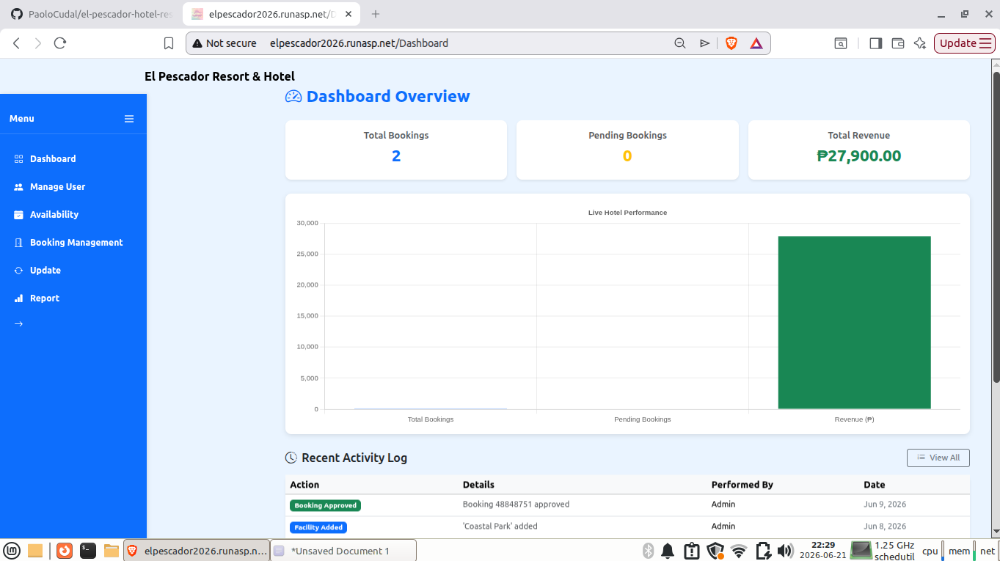
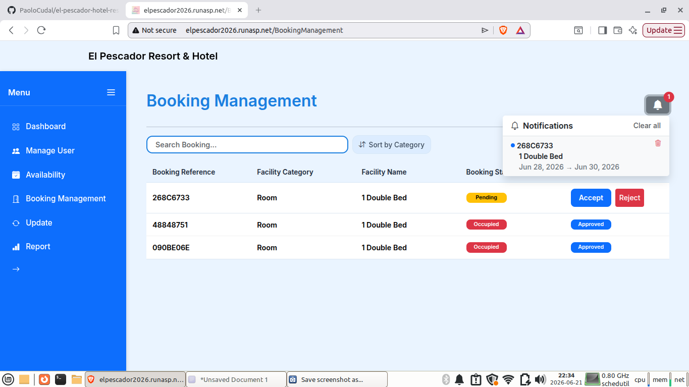

# 🏨 El Pescador Resort — Online Booking Reservation System

> A full-stack hotel reservation platform enabling guests to book rooms and venues online,
> while administrators manage bookings, availability, and generate reports in real time.
> Developed and deployed to production on shared hosting.

🌐 **Live Demo:** [http://elpescador2026.runasp.net](http://elpescador2026.runasp.net)
> 📌 Optimized for **desktop browsers only**. Hosted on shared hosting — may take a few seconds on first load.

---

## 🚀 What This System Does

**For Guests:**
- Browse available rooms and venues with a live availability calendar
- Book facilities online with instant date conflict detection
- Receive automated email confirmation and cancellation notifications
- Manage active bookings and maintain a favorites list
- Reset password securely via email token

**For Administrators:**
- Manage all facilities (rooms, venues, amenities) with image uploads
- Control availability calendar — manually block or unblock dates per room or venue for walk-in bookings
- Approve or reject bookings with one click — client gets notified instantly via email
- Soft delete facilities with full undo support — cascades to bookings, favorites, and availability
- Generate and download branded PDF reports:
  - 📄 Financial Report — approved bookings with revenue breakdown
  - 📄 Booking Report — all bookings with status summary
  - 📄 Occupancy Report — room and venue occupancy rate per date range
- Monitor all admin actions through a real-time activity log
- View dashboard stats — total bookings, pending check-ins, and total revenue

---

## ⚡ Real-Time Features (SignalR)
- New booking requests appear instantly on the admin dashboard without page refresh
- Date blocking and unblocking broadcasts to all connected clients the moment a booking is made or cancelled
- Facility updates (add, edit, delete) reflect immediately across all sessions

---

## 🛠️ Tech Stack

| Layer | Technology |
|---|---|
| Framework | ASP.NET Core 8 Razor Pages |
| API | REST API (30+ JSON endpoints) |
| ORM | Entity Framework Core 8 |
| Database | MySQL |
| Real-time | ASP.NET Core SignalR |
| Auth (Client) | Cookie Authentication + BCrypt |
| Auth (Admin) | JWT Bearer Tokens |
| Email | MailKit + Brevo SMTP |
| PDF Generation | QuestPDF |
| Frontend | Bootstrap 5, Flatpickr, Vanilla JS, Custom CSS |
| Deployment | MonsterASP.NET (shared hosting, x86 self-contained publish) |

---

## 🌐 REST API Endpoints

### 🔐 Auth — `/api/auth`
| Method | Endpoint | Description |
|---|---|---|
| POST | `/register` | Register new client |
| POST | `/login` | Login client |
| POST | `/logout` | Logout client |
| GET | `/me` | Get current session |
| GET | `/check-email` | Check if email exists |
| POST | `/check-password` | Verify current password |
| POST | `/forgot-password` | Send password reset email |
| POST | `/reset-password` | Reset password via secure token |

### 🏨 Customer — `/api/customer`
| Method | Endpoint | Description |
|---|---|---|
| GET | `/home-index` | Get featured room cards for homepage |
| GET | `/rooms` | Get all rooms grouped by building |
| GET | `/venues` | Get all venue cards |
| GET | `/amenities` | Get all amenity cards |
| GET | `/resort-highlights` | Get resort highlight sections |
| GET | `/facility/{id}` | Get facility by ID |
| GET | `/availability/month` | Get monthly availability calendar |
| GET | `/availability/check` | Check room availability for dates |
| GET | `/availability/check-venue` | Check venue availability for dates |

### 📋 Booking — `/api/booking`
| Method | Endpoint | Description |
|---|---|---|
| POST | `/create` | Create a new booking |
| POST | `/preview` | Preview booking cost before confirming |
| GET | `/summary` | Get booking summary by reference |
| GET | `/active/{clientId}` | Get active bookings for a client |
| GET | `/my-account/{clientId}` | Get account info and favorites count |
| POST | `/cancel/{bookingReference}` | Cancel a booking |

### 🛠️ Admin — `/api/admin` *(JWT required)*
| Method | Endpoint | Description |
|---|---|---|
| GET | `/facilities` | Get all active facilities |
| GET | `/facilities/deleted` | Get soft-deleted facilities |
| POST | `/facility` | Add new facility with images |
| PUT | `/facility/{id}` | Update facility and images |
| POST | `/facility/{id}/delete` | Soft delete a facility |
| POST | `/facility/{id}/undo` | Restore a soft-deleted facility |
| GET | `/availability/month` | Get monthly availability calendar |
| POST | `/availability` | Block date range for walk-in bookings |
| POST | `/availability/unblock` | Unblock date range |
| GET | `/bookings` | Get all bookings for management |
| POST | `/booking/{id}/approve` | Approve a booking |
| POST | `/booking/{id}/reject` | Reject a booking |
| GET | `/users` | Get all registered clients |
| GET | `/dashboard/stats` | Get dashboard stats |
| GET | `/activity-logs` | Get recent activity logs |
| DELETE | `/activity-logs/{id}` | Delete an activity log entry |

### 📊 Reports — `/api/admin/reports` *(JWT required)*
| Method | Endpoint | Description |
|---|---|---|
| GET | `/financial` | Download financial report PDF |
| GET | `/bookings` | Download booking report PDF |
| GET | `/occupancy` | Download occupancy report PDF |

### 👨‍💼 Staff — `/api/staff`
| Method | Endpoint | Description |
|---|---|---|
| POST | `/login` | Admin login — returns JWT token |

---

## 📐 Architecture Highlights

- **Service Layer Pattern** — `BookingService`, `FacilityService`, `EmailService`, `ReportService`, `StaffService` injected via DI; controllers stay thin and focused
- **Dual Auth Strategy** — clients use Cookie authentication for Razor Pages; admins use JWT Bearer for API endpoints, keeping both flows completely separate
- **Soft Delete with Undo** — deleting a facility cascades to room types, venues, images, favorites, and availability records in one transaction; undo reverses everything
- **Transaction Safety** — booking creation, approval, and cancellation all run inside `BeginTransactionAsync` with full rollback on failure
- **Availability System** — `tblAvailability` tracks blocked dates per facility, room type, and venue; admin manually blocks dates for walk-in bookings while online bookings are blocked automatically
- **SignalR Groups** — admins join a named `"Admins"` group for targeted new booking notifications; date block/unblock events broadcast to all connected clients instantly
- **QuestPDF Reports** — generates branded A4 reports with summary stat cards, zebra-striped tables, hotel logo header, and paginated footer
- **BCrypt + Secure Token** — client passwords hashed with BCrypt cost factor 10; password reset uses `RandomNumberGenerator` with 30-minute token expiry

---

## 🚀 Getting Started (Local Setup)

### Prerequisites
- .NET 8 SDK
- MySQL
- Visual Studio 2022 or VS Code

### 1. Clone the repo
```bash
git clone https://github.com/PaoloCudal/el-pescador-hotel-reservation-system.git
cd el-pescador-hotel-reservation-system
```

### 2. Create `appsettings.Development.json`
This file is gitignored — create it locally with your own credentials:
```json
{
  "ConnectionStrings": {
    "DefaultConnection": "server=localhost;port=3306;database=HotelReservationDB;user=root;password=YOUR_PASSWORD;"
  },
  "Jwt": {
    "Secret": "YOUR_JWT_SECRET_MIN_32_CHARACTERS",
    "Issuer": "HotelReservationWeb",
    "Audience": "HotelClients"
  },
  "SMTP": {
    "Host": "smtp-relay.brevo.com",
    "Port": "587",
    "Username": "YOUR_BREVO_USERNAME",
    "Password": "YOUR_BREVO_API_KEY",
    "Email": "YOUR_SENDER_EMAIL"
  },
  "App": {
    "BaseUrl": "https://localhost:7001"
  }
}
```

### 3. Apply migrations
```bash
dotnet ef database update
```

### 4. Run
```bash
dotnet run
```

---

## 📁 Project Structure

```
HotelReservationWeb/
├── Controllers/
│   ├── Admin_Controller/
│   │   ├── AdminController.cs          # Facility, booking, user, availability management
│   │   └── AdminReportController.cs    # PDF report generation endpoints
│   ├── Client_Controller/
│   │   ├── Auth/UserAuthController.cs  # Register, login, password reset
│   │   └── BookingController/          # Booking create, preview, cancel
│   ├── CustomerController.cs           # Public facility and availability endpoints
│   └── StaffController.cs             # Admin JWT login
├── Data/
│   └── ApplicationDbContext.cs         # EF Core DbContext
├── Hubs/
│   └── HotelHub.cs                    # SignalR hub
├── Models/
│   ├── Model_Staff/                   # Facility, Booking, RoomType, Venue, etc.
│   └── Models_Client/                 # HotelClient, Favorite
├── Pages/
│   ├── Accounts/Admin/                # Admin Razor Pages + DTOs
│   └── Accounts/User/                 # Client Razor Pages + DTOs
├── Services/
│   ├── BookingService.cs              # Booking logic, approval, cancellation
│   ├── FacilityService.cs             # Facility CRUD, soft delete, availability
│   ├── EmailService.cs                # MailKit SMTP confirmation & cancellation
│   ├── ReportService.cs               # QuestPDF financial, booking, occupancy reports
│   └── StaffService.cs                # Admin JWT authentication
└── wwwroot/
    ├── css/                           # Custom page-specific stylesheets
    ├── js/                            # Page-specific JavaScript
    └── lib/                           # Bootstrap, jQuery, validation libraries
```

---

## 📸 Screenshots

### Homepage


### Availability Calendar


### Admin – Walk-in Availability Calendar


### Admin Dashboard


### Booking Approval


---

## 👨‍💻 Author

**Paolo Cudal**
💼 Full Stack .NET Developer Role

📧 paolocudal1@gmail.com
🔗 [Portfolio](https://paolocudal.github.io/web-portfolio/) · [GitHub](https://github.com/PaoloCudal) · [LinkedIn](https://www.linkedin.com/in/paolo-cudal-016754346/)
